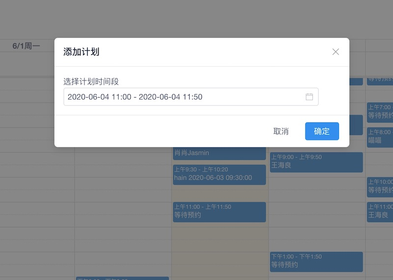
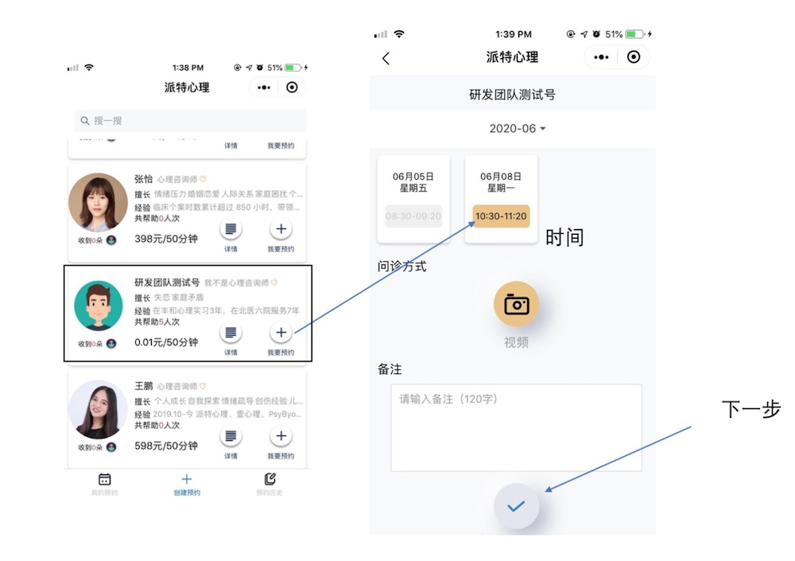
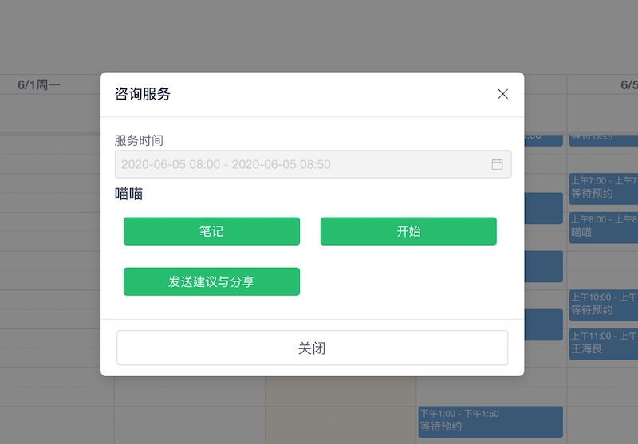
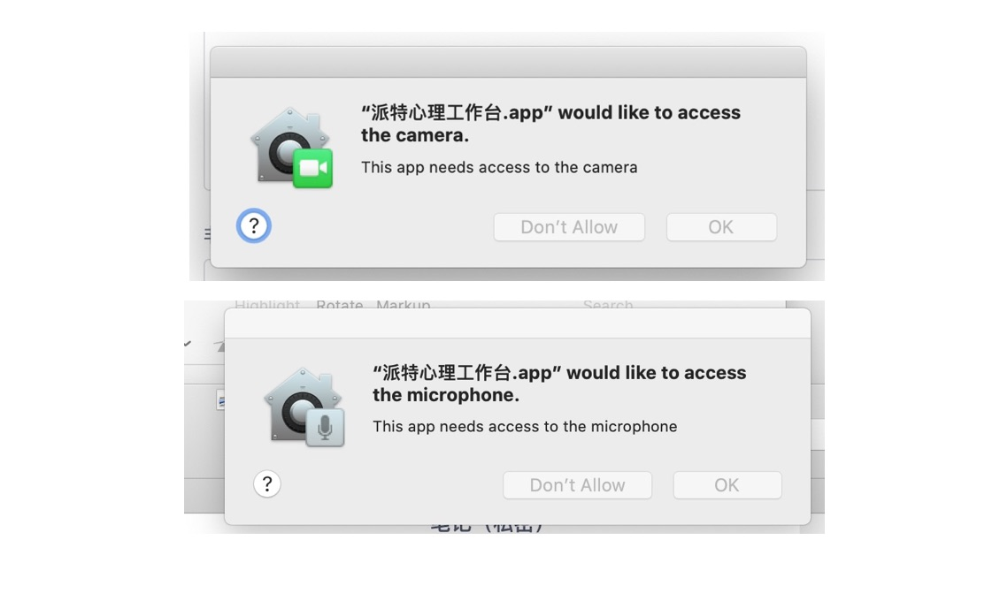
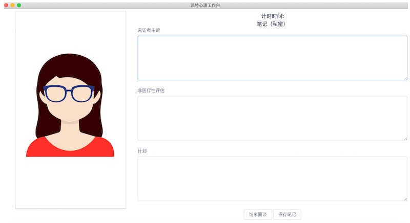

# 派特心理工作台

现在派特心理工作台可以在 _10_ 分钟内介绍完，这是派特心理有意为之，产品要简单实用，这样心理咨询师可以更专注。同时，派特心理工作台第一版本，关注为咨询师提供核心的价值：高效率的规划时间；减轻预约的过程；专注帮助来访者。

这是通过我们更多科技元素，同时提供运营人员实现的，我们为每个咨询师提供可直接联系的*派特心理咨询顾问*。借助派特心理工作台，您可以花更少的时间，服务更多咨询者。

## 下载派特心理工作台

派特心理工作台发布了 Windows 安装包和 Mac 安装包，下载地址为：

[https://static-public.chatopera.com/pet/installer/](https://static-public.chatopera.com/pet/installer/)

从浏览器中打开以上链接，您将看到不同操作系统的安装文件：Windows 安装包以`.exe`为后缀；Mac 安装包以`.dmg` 为后缀。

 
<b>安装包列表</b>

派特心理工作台的安装包前缀是`PetPsy-Workspace`，*构建时间*是安装包创建时间，日期距离当前越近则工作台程序越新，功能也更完善，上传日期是创建后，被上传到公开发布路径的日期。派特心理目前迭代速度快，入驻咨询师我们会通过邮件发布更新提醒。

以下内容，以 Mac OSX 为例展示使用过程，Windows 用户使用派特心理的过程是相似的，派特心理的不同桌面客户端是相同的设计。

## 安装和启动

下载派特心理工作台以后，双击安装包进入安装界面。根据安装界面提示，安装软件到系统应用中心。

注意：在不同操作系统会提示，“信任安全”问题，请选择信任或仍然安装。目前派特心理不需要操作系统管理员权限，请放心使用。

在安装成功后，在桌面或应用中心，可找到“派特心理工作台”启动方式。

 
<b>派特心理工作台 @ Mac OSX  启动中心</b>

## 启动和登录

在启动中心，打开*派特心理工作台*。

 
<b>登录界面</b>

正常的启动流程需要 _3_ 秒钟，如果您长时间未打开程序，请联系*派特心理咨询顾问*。输入您的派特心理咨询师账号的用户名和密码，点击“登录”，如验证不通过，请确保您的输入信息正确，再次“登录”，您也可以使用“忘记密码”进行密码重置。

## 主界面

登录成功后，进入主界面。

 
<b>主界面</b>

目前，主界面是一个日历，咨询师的工作记录、工作计划、咨询预约状态和每个咨询的信息记录，都是从日历上管理或打开。

## 创建预约时间段

咨询者在派特心理小程序中，浏览咨询师的可预约时间时，是根据咨询师在日历上的设置相关的。日历中黄色背景的日期是当天，咨询师可在明天及未来的一个时间点上，点击日历的对应空白区域，这时会弹出对话框。

 
<b>创建预约时间段</b>

目前，派特心理咨询平台设定每个咨询是 _50_ 分钟，咨询师不能设置小于或大于该时间段的计划。该值是常用于心理咨询的经验值，未来为咨询师提供更多灵活的设置。点击“保存”，回到主界面，可以看到新创建的预约。

在咨询者使用派特心理小程序，进行预约心理咨询师，将会看到您的可预约时间，选择时间，完成支付。

 
<b>预约时间段展示在预约过程</b>

派特心理推荐您在每周一个固定时间设置未来一周的可用于咨询的时间，同时您可以尽量宽泛的设定，不要过于保守，因为如果咨询者看到您的可预约时间很少，对于想要得到您对帮助的咨询者有很大的伤害，如果您需要调整一个已预约的时间段，可以随时联系`心理咨询顾问`帮您协调新的时间，保证咨询者和咨询师顺利的进行线上咨询。

## 查看预约状态

在日历上，每个计划时间段，有不同状态：

| 状态     | 含义                                   |
| -------- | -------------------------------------- |
| 等待预约 | 该时间段还没有人预约                   |
| 某某某   | 当一个时间段出现人名，则代表已经被预约 |

可以用通过 `Cmd + R`(Mac) 或 `Ctrl + R`(Windows)来刷新主界面，查看最新的状态。

## 进入咨询会议室

每个被预约的会议，可以提前 10 分钟进入会议室等待咨询者上线，方法是在该时间段上点击一下，弹出如下对话框。

 
<b>进入咨询会议室</b>

**点击开始，您会被询问允许`派特心理工作台`使用操作系统摄像头和麦克风，此处务必选择“允许”，否则您将无法和咨询者进行音视频会话。**

 
<b>进入咨询会议室</b>

提前进入会议室是一种礼貌，您如果迟到想必给咨询者带来很大的失望。也需要您以健康积极的形象加入会议。用爱心接待每一个来访者是心理咨询师的美德，每次咨询都应该给咨询者一期一会之感。

## 咨询中的注意

 
<b>咨询进行中</b>

在心理咨询者加入之前，您在摄像头看到的是自己的画面，咨询者接入后，您看到的是对方的视频画面。开始咨询后，您可以在笔记中记录资料，该资料将有助于您更好的服务咨询者。

在咨询进行时，咨询者可以在右侧看到会议计时，请把握时间结束会话，不要拖延会议，以造成影响下一个咨询；给咨询者更多免费咨询的不良习惯；遵守时间是正视心理咨询的职业规范。

您可以点击`保存笔记`或`结束面谈`完成相关操作。

- 即将开放*音频*咨询，不会采集双方摄像头。

## 技术支持和反馈

对于您在使用过程中，按照上述介绍依然有不理解或软件工作不正常的情况，或者建议和反馈，请联系心理咨询顾问**领悟**(微信：`wxl20150919t`，邮箱：`xianli@chatopera.com`)。

本站也会不断更新，请随时来文档中心查看最新版本功能介绍。

# 平台服务费及付款

派特心理平台在 2020 年 6 月初进行内测，6 月中旬公开推广。

现通过内部推荐形式和邀约形式招募心理咨询师入驻内测平台，内测及 7 月 1 日前，咨询师在平台接单，完成咨询服务，平台不提成，按照咨询者支付的金额，咨询服务通过派特心理平台完成后，5 天内通过微信支付形式转账给咨询师。要求咨询师不迟到，不早退。

咨询服务后，咨询者发生投诉等，我们将按照国家法律规定要求，对第三方监管机构提供平台所具备的数据，但是第一时间平台会和咨询者沟通投诉原因，以便妥善解决，在不得已情况下才通过法律途径解决。要求咨询师在咨询中提供专业服务，平台不会录音、录视频等采集咨询服务中的敏感信息，对于咨询师在提供给咨询者的服务中，请遵循职业规范，不做精神障碍等心理疾病的诊断和医治。对于存在心理疾病应建议咨询者就医。

内测期过后，即 2020 年 7 月 1 日前后起始，派特心理与咨询师签订正式合作协议，内附有分成方法等，暂定平台服务费 15%，正式合作协议一年一续。

派特心理平台及其它心理健康产品在不断的提升，作为一个新的平台，我们在理念、产品和服务上，有独特的定位，面向咨询师，派特心理就是您的合作伙伴，请多关照！

# 入驻派特心理

现阶段，我们设计两种心理咨询师角色：成熟心理咨询师，也简称为心理咨询师；新手心理咨询师。入驻的咨询师需要满足下面条件：

## 成熟心理咨询师

### 学历培训

- 心理咨询/临床心理专业硕士及以上学历，毕业证书。
- 心理学相关专业本科毕业证书。_≥2_ 年的心理咨询/心理治疗的系统长程培训，需出示培训证明。

以上两个条件满足其一。

### 伦理培训

_≥12_ 小时的伦理培训，需出示培训证明。

### 咨询经验

收费个体咨询小时数 ≥800 小时（面对面或视频咨询），需出示时数证明。

### 接受督导

个体督导小时数 _≥100_ 小时（面对面或视频督导），需出示时数证明。

注意：若咨询师从业不满 _5_ 年，应继续接受督导，需提供督导联系方式。

### 个人体验

_≥100_ 小时的个人体验经历并继续接受个人体验。

## 新手心理咨询师

### 学历培训

- 心理咨询/临床心理专业硕士及以上学历，毕业证书。
- 心理学相关专业本科毕业证书。_≥2_ 年的心理咨询/心理治疗的系统长程培训，需出示培训证明。

以上两个条件满足其一。

### 伦理培训

_≥12_ 小时的伦理培训，需出示培训证明。

### 咨询经验

收费个体咨询小时数 ≥30 小时（面对面或视频咨询），需出示时数证明。

### 接受督导

正在接受持续稳定的个体督导（面对面或视频督导）。

注意：若咨询师从业不满 _5_ 年，应继续接受督导，需提供督导联系方式。

### 个人体验

正在接受个人体验。

## 联系我们

如果您满足以上条件，请联系派特心理咨询顾问。

 
<b>心理咨询顾问</b>

